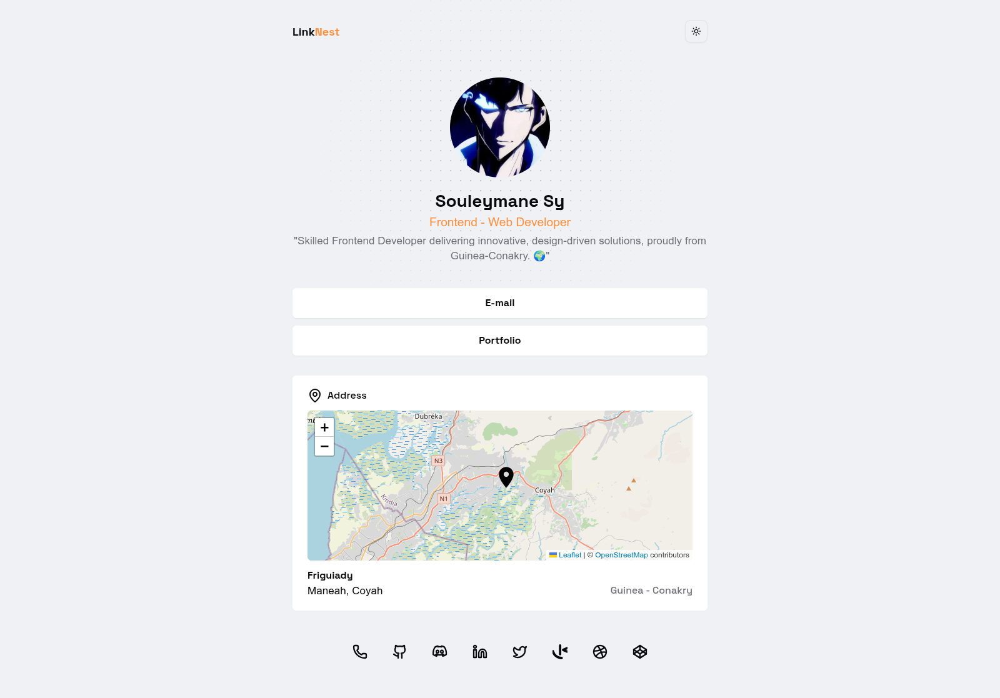

# LinkNest - Personal Profile



## Description

LinkNest is a personal web page designed to showcase my profile as a **frontend web developer**. Inspired by [Linktree](https://linktr.ee/) , this webpage allows visitors to discover my contact information, location, and portfolio through an interactive interface. It is built using modern technologies.

## Features

- **Personal Presentation**: Display of my name, title, and a brief description.
- **Interactive Location**: A map showing my location at Friguiady, Coyah, Guinea-Conakry.
- **Dynamic Portfolio**: Section with links to my socials.
- **Contact Options**: Easy access to email and social media links.

## Technologies Used

- **Next.js**: React framework for optimal performance and server-side rendering.
- **Typescript**: strongly typed programming language that builds on JavaScript,giving you better tooling at any scale.
- **TailwindCSS**: Used for responsive and customized design.
- **shadcn**: Reusable UI components for a modern interface.
- **lucide-react**: Vector icons for a rich visual experience.
- **Framer Motion**: Smooth animations to enhance interactivity.
- **Leaflet**: Integration of interactive maps.
- **Prettier & ESLint**: Formatting and linting tools to maintain clean code.

## Installation

1. Clone the repository:

   ```bash
   git clone https://github.com/souleymanesy7/linknest-linktree-clone.git
   ```

2. Navigate to the directory:

   ```bash
   cd linknest-linktree-clone
   ```

3. Install dependencies:

   ```bash
   bun install
   ```

4. Run the project:

   ```bash
   bun dev
   ```

5. Open [http://localhost:3000](http://localhost:3000) in your browser.

## Usage

- Click on "Portfolio" to view my projects.
- Use the map to explore my location.
- Click the social icons to connect with me.

## Contact

- **Email**: [souleymanesydeveloppers@gmail.com](mailto:souleymanesydeveloppers@gmail.com)
- **GitHub**: [github.com/SouleymaneSy7](https://github.com/souleymanesy7)
